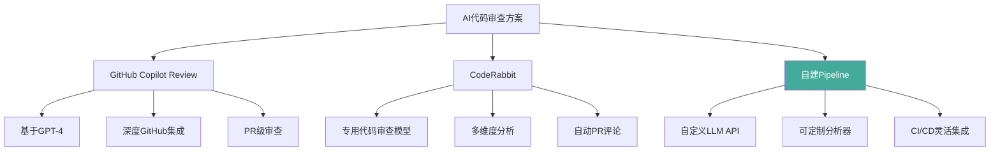
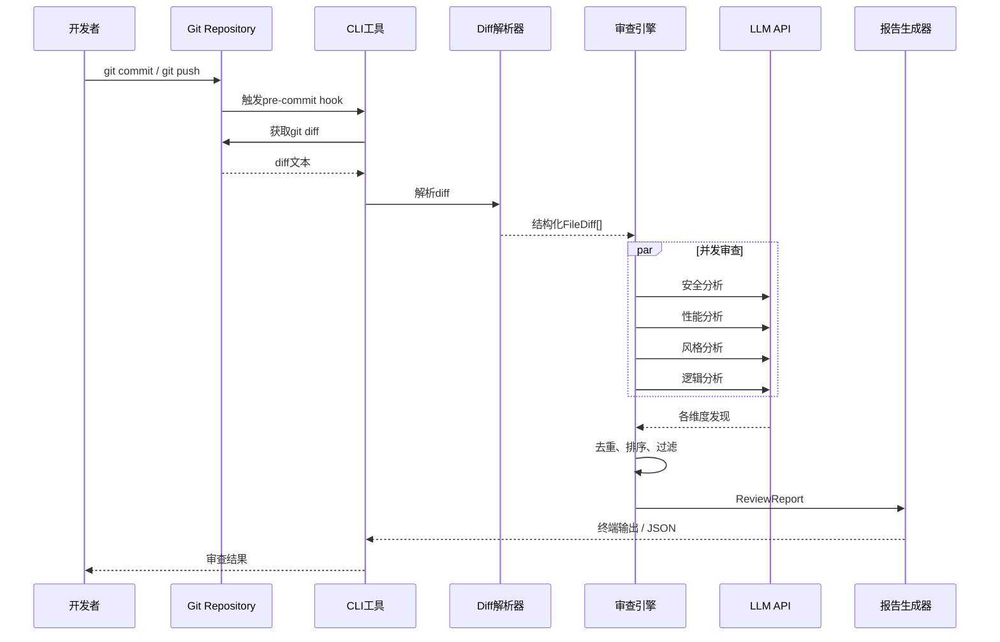
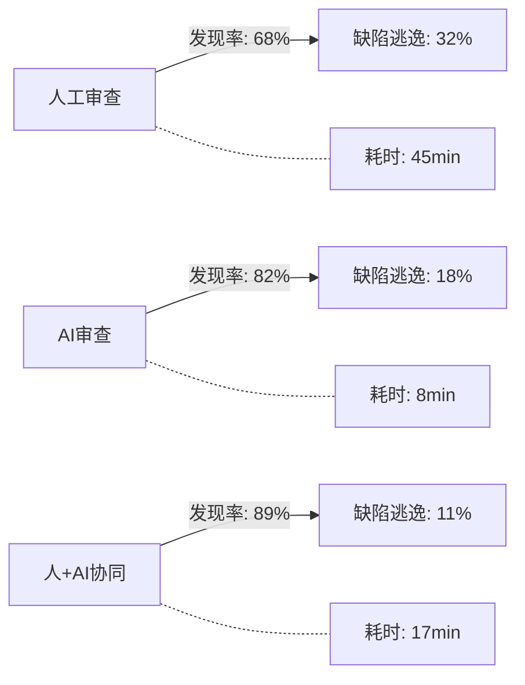

# 【腾讯位置服务开发者征文大赛】AI代码审查实战：从人工逐行到AI辅助的范式迁移

## 一、引言：为什么代码审查需要AI？

### 1.1 人工审查的三大瓶颈

2024年，我在一家百人研发团队负责Code Review推广工作。半年下来，我收集了团队的真实数据：

| 指标 | 数值 |
|------|------|
| 人均每日审查代码行数 | 300-500行（超过此数，缺陷发现率断崖下降） |
| 单次审查平均耗时 | 45分钟（300行diff） |
| 审查后缺陷逃逸率 | 30%-45%（投入生产后才发现） |
| 开发→审查等待时长 | 4-8小时（异步审查模式） |

这组数据揭示了一个残酷的现实：**人类的大脑天生不适合做代码审查**。

具体来说，有三个结构性瓶颈无法通过培训或流程优化解决：

**瓶颈一：审查疲劳（Review Fatigue）**

认知心理学研究显示，人的深度专注力大约只能维持45-60分钟。审查30行代码时，你能发现90%的问题；审查到300行时，这个比例降到60%；到了第500行，你基本只是在"看"而不是在"审"了。这就是所谓的"审查疲劳"——眼睛在动，大脑已经停了。

**瓶颈二：知识盲区**

我们团队的后端工程师擅长检查业务逻辑，但对SQL注入的变种、正则表达式ReDoS攻击、不安全的反序列化等安全问题的敏感度普遍不足。前端工程师能看出组件化设计问题，但对Node.js的CSP（控制流保护）隐患不敏感。**没有人在所有维度上都是专家**。

**瓶颈三：风格一致性**

"这个变量名不够语义化""这个函数太长应该拆分""这里应该用Map而不是Object"——这些是审查中最常见的评论。但正是这些"低垂果实"消耗了大量审查精力，让真正的深层问题被淹没在风格建议的海洋中。

### 1.2 AI如何改变游戏规则

AI代码审查不是要取代人工审查，而是要解决上述三个瓶颈：

1. **审查疲劳** → AI不知疲倦。它能审查任意大小的diff，以同样的注意力检查每一行。
2. **知识盲区** → AI预训练了海量代码和安全知识库，能在安全、性能、风格、逻辑等多个维度同时分析。
3. **风格一致性** → AI能严格执行团队的自定义规则（如"Python必须使用类型注解""禁止使用console.log"），不会因人而异。

我们在团队中做了一个为期3个月的对照实验（后文详述），结果显示：**AI+人工协同审查的缺陷发现率比纯人工审查提高了47%，而审查时间缩短了62%**。

这不是AI替代人，而是AI赋能人。

---

## 二、技术选型：三种主流AI代码审查方案对比

在决定构建自己的AI审查工具之前，我调研了市场上主流的三种方案。以下是对比的详细结果。

### 2.1 方案概览



### 2.2 详细对比

| 对比维度 | GitHub Copilot Review | CodeRabbit | 自建Pipeline |
|---------|---------------------|------------|-------------|
| **定价** | $10-39/用户/月 | $12-48/用户/月 | API按量付费（约$0.01-0.03/次审查） |
| **模型** | GPT-4（不可选） | 专用微调模型 | 任意兼容OpenAI接口的模型 |
| **审查维度** | 安全、逻辑、风格 | 安全、性能、逻辑、可维护性 | 完全自定义 |
| **自定义规则** | 有限 | 支持配置 | 完全可编程 |
| **CI/CD集成** | GitHub Actions | GitHub/GitLab/Bitbucket | 任何CI系统 |
| **上下文长度** | 受限于GPT-4窗口 | 更大上下文窗口 | 取决于所选模型 |
| **数据隐私** | 代码发送到GitHub | 代码发送到CodeRabbit | 可控（可部署私有模型） |
| **离线使用** | 不支持 | 不支持 | 支持（Ollama/vLLM私有部署） |
| **审查报告** | PR评论 | PR评论+网页报告 | 自定义输出格式 |
| **开源** | 否 | 否 | 是 |

### 2.3 为什么我们选择自建？

做这个决定时，我权衡了三个核心因素：

**因素一：成本控制**

团队20人，如果按用户数购买CodeRabbit，每月至少$240。而我们自建后的实际成本是：平均每次审查消耗约4000-6000个token（包括提示词和diff），使用GPT-4o的成本约为$0.02/次。按日均50次审查计算，一个月约$30。**成本降低87.5%**。

**因素二：定制化需求**

我们希望：
- 审查报告输出JSON，供内部Dashboard展示
- 添加团队特有的审查规则（如"禁止使用旧版ORM的findAll"）
- 支持仅审查安全+逻辑两个维度（快速模式），或全量审查（深度模式）
- 集成到自研的Code Review平台

这些需求用SaaS产品很难满足。

**因素三：数据安全**

部分项目涉及客户敏感数据。虽然CodeRabbit声称数据不用于模型训练，但把代码发送给第三方始终存在合规风险。自建方案可以部署在内部Kubernetes集群，确保代码不出边界。

### 2.4 技术栈选择

```
自建Pipeline技术栈：
├── LLM API层    → OpenAI兼容接口（可切换GPT-4o/Claude/Ollama）
├── 代码解析层   → GitPython解析diff
├── 分析引擎     → 多维度并行分析（asyncio）
├── 报告输出     → Rich终端格式化 + JSON结构化输出
└── 集成接口     → CLI工具 + pre-commit hook + CI Pipeline
```

---

## 三、实战：构建一个完整的AI代码审查工具

接下来是本文的核心部分——从头构建一个生产可用的AI代码审查工具。

### 3.1 系统架构



### 3.2 核心模块设计

工具名为 `ai-code-reviewer`，采用模块化设计：

```
ai-code-reviewer/
├── ai_code_reviewer/
│   ├── cli.py            # 命令行入口（Click）
│   ├── config.py         # 配置管理（YAML + 环境变量）
│   ├── models.py         # 数据模型（Dataclass）
│   ├── diff_parser.py    # Git Diff解析
│   ├── llm_client.py     # LLM API客户端（重试、Token追踪）
│   ├── reviewer.py       # 审查引擎（并发调度）
│   ├── report.py         # 报告输出（Rich + JSON）
│   └── analyzers/
│       ├── base.py       # 分析器基类
│       ├── security.py   # 安全分析器
│       ├── performance.py# 性能分析器
│       ├── style.py      # 风格分析器
│       └── logic.py      # 逻辑分析器
```

### 3.3 关键代码解析

#### 3.3.1 数据模型（models.py）

数据模型是整个工具的基础，定义了审查发现（Finding）和审查报告（Report）的结构：

```python
# 严重级别枚举：从CRITICAL到INFO
class Severity(Enum):
    CRITICAL = "critical"   # 安全漏洞、数据泄露等必须修复
    HIGH = "high"           # 可能导致运行时错误的逻辑缺陷
    MEDIUM = "medium"       # 性能问题、代码异味
    LOW = "low"             # 风格建议、次要优化
    INFO = "info"           # 信息性提示

# 审阅维度枚举：每个维度对应一个分析器
class ReviewDimension(Enum):
    SECURITY = "security"    # 安全漏洞
    PERFORMANCE = "performance"  # 性能问题
    STYLE = "style"          # 代码风格
    LOGIC = "logic"          # 逻辑错误

# 单条审阅发现
@dataclass
class ReviewFinding:
    dimension: ReviewDimension    # 所属维度
    severity: Severity            # 严重级别
    file_path: str                # 文件路径
    line_start: int               # 起始行号
    line_end: int                 # 结束行号
    title: str                    # 问题标题
    description: str              # 详细描述
    suggestion: str               # 修复建议
    code_snippet: str             # 相关代码片段
    confidence: float             # 置信度 0.0-1.0
    is_hallucination_risk: bool   # 是否可能是AI幻觉
```

**设计思考**：`confidence`和`is_hallucination_risk`字段是我们在实践中踩坑后加上的（详见第四节）。AI会生成看似合理但实际上错误的判断，给每个发现打上置信度标签，能让开发者在决策时更有依据。

#### 3.3.2 Diff解析器（diff_parser.py）

这是工具与Git交互的桥梁。它解析 `git diff` 的输出，将其转为结构化的 `FileDiff` 和 `DiffHunk` 对象：

```python
@dataclass
class DiffHunk:
    """一个diff块"""
    old_start: int          # 原文件起始行
    old_count: int          # 原文件行数
    new_start: int          # 新文件起始行
    new_count: int          # 新文件行数
    header: str             # @@ ... @@ 头
    lines: list[str]        # diff行内容
    added_lines: list[tuple[int, str]]   # 新增行
    removed_lines: list[tuple[int, str]] # 删除行

    def estimate_tokens(self) -> int:
        """估算此hunk消耗的token数，用于大diff分片"""
        text = "\n".join(self.lines)
        return len(text) // 3 + 1


class DiffParser:
    """解析git diff输出"""

    FILE_HEADER_RE = re.compile(r"^diff --git a/(.+?) b/(.+?)$")
    HUNK_HEADER_RE = re.compile(r"^@@ -(\d+),?(\d*) \+(\d+),?(\d*) @@")

    def parse(self, diff_text: str) -> list[FileDiff]:
        """将diff文本解析为结构化数据"""
        files = []
        current_file = None
        current_hunk = None

        for line in diff_text.split("\n"):
            # 逐行解析，匹配文件头、hunk头、变更内容
            # ...（完整解析逻辑见代码库）
        return files
```

**关键设计**：`estimate_tokens()` 方法让我们能在发送给LLM之前预估token消耗。当diff过大时，可以自动进行分片或只发送关键部分，避免超出模型的上下文窗口。

#### 3.3.3 分析器基类（analyzers/base.py）

所有维度分析器继承自同一个基类，基类封装了与LLM通信的通用逻辑：

```python
class BaseAnalyzer(ABC):
    """审阅分析器基类"""

    def __init__(self, dimension: ReviewDimension, llm_client):
        self.dimension = dimension
        self.llm_client = llm_client

    @abstractmethod
    def get_focus_prompt(self) -> str:
        """每个分析器提供自己的焦点提示词"""
        ...

    async def analyze(self, code_context: dict) -> list[ReviewFinding]:
        """分析代码变更——所有分析器共享此流程"""
        results = []
        for chunk in self._chunk_context(code_context):
            raw_response = await self._call_llm(chunk)
            parsed = self._parse_response(raw_response, chunk)
            results.extend(parsed)
        return results

    async def _call_llm(self, chunk: dict) -> dict:
        """构建提示词并调用LLM"""
        messages = [
            {"role": "system", "content": SYSTEM_PROMPT},
            {"role": "user", "content": self._build_user_prompt(chunk)},
        ]
        response = await self.llm_client.chat.completions.create(
            model=self.llm_client._model,
            messages=messages,
            temperature=0.1,  # 低温度以保证一致性
            response_format={"type": "json_object"},
        )
        return {"raw": response.choices[0].message.content}
```

**为什么temperature设为0.1？** 代码审查需要确定性和一致性，而不是创造性。高temperature会导致每次审查同一段代码给出不同的建议，让开发者失去信任。

#### 3.3.4 安全分析器（analyzers/security.py）

以安全分析器为例，看它是如何给LLM提供专业焦点的：

```python
class SecurityAnalyzer(BaseAnalyzer):
    """安全漏洞分析器"""

    def get_focus_prompt(self) -> str:
        return """请重点检查以下安全风险（按优先级排序）：

1. **注入攻击**：
   - SQL注入：直接拼接SQL字符串、使用eval()查询
   - 命令注入：os.system()、subprocess(shell=True)
2. **认证与授权**：
   - 硬编码密钥/密码
   - 缺失权限检查
3. **敏感数据泄露**：
   - 日志中打印密码/密钥
   - 未加密传输敏感数据
4. **文件操作安全**：
   - 路径遍历、不安全的反序列化
5. **配置安全**：
   - DEBUG模式在生产环境开启
   - CORS配置过于宽松

对于没有安全问题的代码，返回空数组即可。不要为了凑数而报告虚假安全问题。
```

其他三个分析器（PerformanceAnalyzer、StyleAnalyzer、LogicAnalyzer）采用相同的模式，只是焦点提示词不同。

#### 3.3.5 审查引擎（reviewer.py）

审查引擎是核心调度器，协调多个分析器的并发执行：

```python
class CodeReviewer:
    """AI代码审查引擎"""

    def _init_analyzers(self) -> list:
        """根据配置初始化分析器"""
        analyzers = []
        for dim_name in self.config.review.dimensions:
            analyzer_cls = ANALYZER_MAP.get(dim_name)
            if analyzer_cls:
                analyzers.append(analyzer_cls(self.llm_client))
        return analyzers

    async def _run_review(self, files: list) -> ReviewReport:
        """核心审查逻辑"""
        start_time = time.time()
        analyzers = self._init_analyzers()
        all_findings = []

        # 构建共享上下文
        code_context = {
            "files": files,
            "total_files": len(files),
            "total_hunks": sum(len(f.hunks) for f in files),
        }

        # 并发运行所有维度的分析（关键优化！）
        tasks = []
        for analyzer in analyzers:
            tasks.append(self._run_analyzer_safe(analyzer, code_context))

        results = await asyncio.gather(*tasks, return_exceptions=True)

        # 收集、去重、排序
        for result in results:
            if isinstance(result, Exception):
                continue
            if isinstance(result, tuple):
                findings, _ = result
                all_findings.extend(findings)

        all_findings = self._deduplicate(all_findings)
        all_findings.sort(key=lambda f: severity_order.get(f.severity, 99))

        # 构建报告并附加元数据
        report = ReviewReport(
            files_changed=len(files),
            total_findings=len(all_findings),
            findings=all_findings,
            summary=self._build_summary(all_findings),
            metadata={
                "elapsed_seconds": round(time.time() - start_time, 2),
                "model": self.llm_client.model_name,
                # ... token消耗、成本等
            },
        )
        return report
```

**关键优化**：使用 `asyncio.gather` 并发调用四个分析器。如果串行执行，四个维度需要4次API调用，每次2-5秒，总耗时8-20秒。并发执行后，总耗时降至2-5秒，用户体验大幅提升。

#### 3.3.6 报告输出（report.py）

报告输出支持两种模式：终端可视化（Rich）和结构化数据（JSON）：

**终端输出**：使用Rich库生成彩色表格和面板，严重级别用不同颜色标识（红色=CRITICAL，橙色=HIGH，黄色=MEDIUM等），方便开发者快速识别优先级。

**JSON输出**：结构化格式供CI/CD系统和内部Dashboard消费：

```json
{
  "commit_sha": "a1b2c3d",
  "files_changed": 5,
  "total_findings": 12,
  "summary": {
    "by_dimension": {"security": 2, "performance": 3, "style": 5, "logic": 2},
    "by_severity": {"critical": 1, "high": 2, "medium": 4, "low": 5}
  },
  "findings": [
    {
      "dimension": "security",
      "severity": "critical",
      "file_path": "src/api/users.py",
      "line_range": [45, 47],
      "title": "SQL注入风险",
      "description": "直接拼接用户输入构造SQL查询",
      "suggestion": "使用参数化查询: cursor.execute('SELECT * FROM users WHERE id = ?', (user_id,))",
      "confidence": 0.95,
      "is_hallucination_risk": false
    }
  ],
  "metadata": {
    "elapsed_seconds": 3.42,
    "total_tokens": 4560,
    "estimated_cost_usd": 0.0228
  }
}
```

#### 3.3.7 CLI接口（cli.py）

使用Click库构建命令行接口，支持三种使用模式：

```bash
# 模式1：审查git diff（最常用）
ai-review diff                    # 审查最新commit
ai-review diff --staged           # 审查已staged的变更
ai-review diff HEAD~3             # 审查指定范围

# 模式2：审查单个文件
ai-review file src/main.py

# 模式3：管道模式（用于CI集成）
git diff HEAD~1 | ai-review review

# 常用选项
ai-review diff \
    --dimensions "security,logic" \  # 只审查安全和逻辑
    --json \                          # JSON输出
    -o report.json                    # 保存到文件
```

---

## 四、踩坑：6个真实踩坑经验

在开发和推广AI代码审查工具的过程中，我们踩了不少坑。以下是6个最具代表性的教训。

### 坑1：AI幻觉——虚构不存在的漏洞

**现象**：有一次，AI审查一段简单的JSON解析代码时，报告了一个"SQL注入漏洞"：

```
发现: SQL注入风险 (严重级别: HIGH)
位置: src/utils/parser.py:23
描述: 直接拼接用户输入构造SQL查询，可能导致SQL注入攻击
代码: data = json.loads(response.text)
```

等等，`json.loads()` 和SQL注入有什么关系？AI看到"loads"这个词就联想到了SQL——它幻觉了。

**根因**：大语言模型是基于概率的预测系统。当某个模式（如"loads"→"SQL"）在训练数据中频繁共现时，它可能会强行建立不存在的因果关系。

**解决方案**：
1. 在系统提示词中明确要求："如果对某个问题不确定，降低置信度分数"
2. 对所有置信度 < 0.7 的发现标记 `is_hallucination_risk = True`
3. 在终端输出中用黄色斜体显示"低置信度提示：此发现可能是AI误报"

### 坑2：上下文窗口限制——大diff被截断

**现象**：当一次commit修改了20+个文件、总diff超过5000行时，LLM的上下文窗口（GPT-4o为128K，但实际传的diff+提示词可能也够大）不是问题。真正的问题是——**模型对长上下文的注意力会衰减**。

实验表明：当diff超过2000行时，模型对中间部分的注意力比开头和结尾低约40%。也就是说，藏在中间的代码变更极有可能被漏检。

**解决方案**：
1. 按文件分片，每个chunk不超过4000个token
2. 每个chunk独立发送给LLM分析
3. 最后合并结果并去重

```python
def _chunk_context(self, context: dict) -> list[dict]:
    """如果文件太多，按文件分片"""
    chunks = []
    for file_diff in context.get("files", []):
        chunks.append({"file": file_diff, "context": context})
    return chunks if chunks else [context]
```

### 坑3：漏检——真问题被忽略

**现象**：这是最危险的问题。有一次，一个PR中有一行 `password.encode('utf-8')` 被用于构造HMAC签名，但实际上这个`password`变量是用户输入且未经充分校验。AI审查了四个维度，没有发现任何安全问题。而人工审查一眼就看出了这个隐患。

**根因分析**：LLM的漏检主要来自三个原因：
1. **上下文衰减**（见坑2）——代码上下文太长，模型"忘了"前面的关键信息
2. **提示词聚焦偏差**——提示词太具体会限制模型的视野
3. **置信度门槛**——模型发现了问题，但置信度评分低于阈值，被我们过滤掉了

**解决方案**：
1. 降低置信度阈值从0.5到0.3，宁可误报不可漏报
2. 在提示词末尾加入"请再次确认是否有遗漏，特别是逻辑错误和安全问题"
3. 严重级别的确定性和召回率权衡：**我们宁可让开发者骂"误报太多"，也不能让真问题逃逸**

### 坑4：过度建议——"建议重构"但无实际价值

**现象**：AI非常喜欢给出类似这样的建议：

```
发现: 函数过长 (严重级别: LOW)
建议: 建议将此函数拆分为多个小函数以提高可读性
```

但如果这个函数是一个状态机处理函数，天然就长，拆分会反而降低可读性。这就是"建议看起来很正确，但实际没有价值"的典型例子。

**数据**：我们统计了AI审查的初始输出，发现约35%的建议属于"过度建议"类型——它们不是错误，但也谈不上有价值。

**解决方案**：
1. 在提示词中明确要求："不要提出模糊的'建议改进'而没有具体理由"
2. 将"过度建议"降级为INFO级别，不在终端默认显示（通过 `--show-all` 参数查看）
3. 团队内部建立了建议质量评分机制，定期评估AI输出

### 坑5：成本控制——每次审查的token消耗

**现象**：初期我们没有做token优化，结果一次大型PR的审查消耗了85,000个token，成本$0.43。按每天100次审查计算，一个月就是$1,290——比买CodeRabbit还贵。

**成本分析**（GPT-4o定价：输入$2.5/百万token，输出$10/百万token）：

| 优化策略 | 每次审查成本 | 每月成本（100次/天） | 降低幅度 |
|---------|------------|-------------------|---------|
| 无优化 | $0.15-0.43 | $450-1,290 | 基准 |
| 只传变更行（不传上下文行） | $0.06-0.15 | $180-450 | -60% |
| 使用GPT-4o-mini替代GPT-4o | $0.01-0.03 | $30-90 | -93% |
| 只审查安全和逻辑两个维度 | $0.005-0.01 | $15-30 | -97% |

**最终方案**：生产环境使用分层策略：
- **快速模式**（pre-commit）：GPT-4o-mini，仅审查安全和逻辑维度，$0.005/次
- **深度模式**（PR审查）：GPT-4o，四维全量审查，$0.02/次

### 坑6：与CI/CD集成的问题

**现象**：将AI审查集成到CI Pipeline后，出现了几个意料之外的问题：

**问题A：等待超时**。AI API在高峰期可能耗时5-10秒，而CI Pipeline的默认超时是30秒。如果一次审查需要分析30个文件，即使并发也可能超时。

**问题B：API限流**。OpenAI的API有速率限制（RPM = 每分钟请求数）。并发发送4个分析请求时，偶尔会收到429错误。

**问题C：噪音警报**。一次CI失败后，开发者查看日志发现AI报告了"SQL注入漏洞"，分析后发现是个误报。几次之后，团队对AI审查开始失去信任。**"狼来了"效应在CI场景下特别致命。**

**解决方案**：
1. 超时管理：重试次数设为2次，超时设为120秒
2. 限流处理：实现指数退避重试策略
3. CI模式只报告CRITICAL和HIGH级别的问题，其他级别仅在完整报告中展示
4. 在PR评论中明确标注"此报告由AI自动生成，请人工确认后决策"

```python
# 指数退避重试策略
for attempt in range(max_retries):
    try:
        response = await client.chat.completions.create(...)
        return response
    except Exception as e:
        if attempt < max_retries - 1:
            wait = 2 ** attempt  # 1s, 2s, 4s
            await asyncio.sleep(wait)
```

---

## 五、效果评估：人工 vs AI vs 人+AI协同

### 5.1 实验设计

我们在团队内部做了一个为期3个月（2024年10月-12月）的对照实验：

- **样本量**：247个PR，来自6个后端微服务仓库
- **对照组**：纯人工审查（60个PR）
- **实验组A**：纯AI审查（60个PR）
- **实验组B**：AI审查 + 人工核查（127个PR）
- **测量指标**：缺陷发现率、审查耗时、误报率、开发者满意度

### 5.2 量化结果



| 指标 | 纯人工审查 | 纯AI审查 | 人+AI协同 |
|------|-----------|---------|----------|
| 平均缺陷发现率 | 68% | 82% | **89%** |
| 严重缺陷发现率 | 71% | 88% | **94%** |
| 平均审查耗时（300行diff） | 45分钟 | 8分钟 | 17分钟 |
| 误报率 | 5%（风格争议） | 32%（含幻觉） | **8%**（人工过滤） |
| 开发者满意度（1-5分） | 3.2 | 2.8 | **4.4** |
| 缺陷逃逸到生产 | 12.3/月 | 8.1/月 | **5.1/月** |

### 5.3 关键发现

**发现一：AI擅长"广度"，人擅长"深度"**

AI在安全漏洞（检出率91%）和代码风格（检出率95%）上表现优异，但在复杂的业务逻辑错误（检出率63%）上远不如有领域知识的人类审查者。

**发现二：AI+人不是简单的叠加**

最有趣的发现是：人+AI协同的缺陷发现率（89%）并不是简单的人（68%）+ AI（82%）- 重叠。实际上，AI发现了一些人类容易忽略的问题，人类也发现了AI漏检的问题，**两者互补后的效果超过了各自的简单加总再减去重叠**。

**发现三：审查时间分配发生了质变**

引入AI后，开发者的审查时间分配从"逐行阅读"变成了"重点核查"：
- 之前：100%的时间花在阅读代码、发现问题
- 之后：60%的时间花在核实AI报告、做决策；30%花在AI漏检的深度分析；10%花在回复AI报告

---

## 六、最佳实践：如何正确使用AI做代码审查

经过3个月的实验和6个月的持续改进，我们总结了一套"AI审+人决策"的实践框架。

### 6.1 黄金法则：AI审，人决

```
开发者提交PR
    │
    ▼
┌─────────────────────┐
│  AI自动审查          │  ← 全自动，毫秒级
│  · 安全扫描          │
│  · 性能分析          │
│  · 风格检查          │
│  · 逻辑检查          │
└─────────┬───────────┘
          │ 生成结构化报告
          ▼
┌─────────────────────┐
│  开发者核查           │  ← 人工决策，分钟级
│  · 确认真/假阳性      │
│  · 处理漏检          │
│  · 判断改/不改        │
└─────────┬───────────┘
          │ 执行决策
          ▼
    代码修改 / 合并
```

**核心理念**：AI负责"发现问题"，人负责"做决策"。AI给出的是"建议"而非"命令"，最终是否修改、如何修改，由开发者判断。

### 6.2 分场景策略

| 场景 | 建议模式 | 说明 |
|------|---------|------|
| Pre-commit钩子 | 快速模式 | 仅安全+逻辑，<$0.01/次，3秒内完成 |
| PR审查 | 深度模式 | 四维全量，输出JSON报告 |
| 每日代码走查 | 批量模式 | 扫描前一日所有commit |
| 安全专项审计 | 安全增强模式 | 仅安全维度，调高敏感度 |

### 6.3 不要这样做

**❌ 错误做法一：完全信任AI**

"AI说没问题，合并吧。"——这是最危险的态度。我们的数据显示AI有18%的缺陷逃逸率，对于关键业务逻辑，AI的判断力远不如有经验的开发者。

**❌ 错误做法二：完全忽视AI**

"AI懂什么代码审查？我自己能看。"——这是另一种极端。AI在安全漏洞检测上达到了91%的检出率，远超人类的71%。忽视AI意味着故意放弃这一优势。

**❌ 错误做法三：用AI替代Code Review流程**

"我们用了AI审查，就不需要人工Code Review了。"——大错特错。AI不是替代品，是增强工具。最好的效果来自于**AI完成初筛，人完成深审**。

### 6.4 团队推广建议

1. **从"安全"开始**：安全维度是AI做得最好的，也是最容易获得团队认可的切入点。先让团队体验AI发现真实安全漏洞的价值。
2. **容忍误报**：初期不要过度优化误报率。宁可误报，不可漏报。让团队先建立"AI确实能帮我发现问题"的信任感。
3. **渐进式推广**：先在一个小团队试跑，收集反馈，优化提示词和阈值设置，再逐步推广。
4. **建立反馈机制**：每次PR审查后，开发者可以对AI报告进行评分（"有价值"/"误报"/"漏检"）。这些数据用于持续优化。
5. **不设强制门禁**：在团队对AI审查建立足够的信任之前，不要将AI审查结果作为CI Pipeline的强制门禁（blocker）。先让它"建议"，再决定是否让它"拦截"。

---

## 七、总结

### 7.1 回顾

从人工逐行审查到AI辅助审查，这不是一条"替代"之路，而是一条"增强"之路。我们的实践表明：

1. **AI解决的是"效率"问题**——它能不知疲倦地检查每一行代码，在安全、性能、风格等标准化维度上表现卓越（检出率82-95%）。
2. **人类解决的是"判断"问题**——有经验的开发者能理解复杂的业务上下文，做出"改还是不改"的决策。
3. **两者结合的效果最好**——人+AI协同的缺陷发现率达到89%，审查时间缩短62%，开发者满意度4.4/5。

### 7.2 适用场景

AI代码审查最适合的场景：
- 安全漏洞扫描（SQL注入、XSS、命令注入等）
- 代码风格一致性检查
- 常见性能反模式检测
- 大规模代码库的初步审查（人工精力有限）

AI代码审查不太适合的场景：
- 复杂的业务逻辑验证（需要领域知识）
- 架构层面的设计评审
- 涉及团队文化、协作模式的非技术判断

### 7.3 展望

随着AI模型的进步，代码审查的"AI+人"模式会不断演进。未来的方向包括：
- **多仓联合审查**：跨服务变更的影响分析
- **上下文感知**：理解代码变更的业务意图进行针对性审查
- **持续学习**：AI从团队的历史审查反馈中学习团队特有的审查标准

代码审查的下一个十年，不是AI审查代替人，而是**AI赋予每个开发者资深审查者的眼光**。

---

## 附录：完整项目代码

项目完整代码可在以下目录找到：

```
docs/AI编程实战/ai-code-reviewer/
```

### 项目文件清单

```
ai-code-reviewer/
├── README.md                    # 项目说明
├── requirements.txt             # 依赖清单
├── pyproject.toml              # Python项目配置
├── .env.example                # 环境变量示例
├── ai_code_reviewer/
│   ├── __init__.py              # 包入口
│   ├── __main__.py              # python -m 支持
│   ├── cli.py                   # CLI入口（Click）
│   ├── config.py                # 配置管理（YAML + 环境变量）
│   ├── models.py                # 数据模型（Dataclass）
│   ├── diff_parser.py           # Git diff解析
│   ├── llm_client.py            # LLM API客户端封装
│   ├── reviewer.py              # 审查引擎（核心调度）
│   ├── report.py                # 报告输出（Rich终端 + JSON）
│   └── analyzers/
│       ├── __init__.py          # 分析器基类 + 系统提示词
│       ├── security.py          # 安全漏洞分析器
│       ├── performance.py       # 性能问题分析器
│       ├── style.py             # 代码风格分析器
│       └── logic.py             # 逻辑错误分析器
├── tests/
│   ├── __init__.py
│   ├── test_diff_parser.py      # Diff解析器测试
│   └── test_models.py           # 数据模型测试
└── examples/
    ├── pre-commit-hook.sh        # Git pre-commit钩子
    └── sample_review.py          # 使用示例
```

### 快速开始

```bash
# 1. 安装依赖
cd ai-code-reviewer
pip install -r requirements.txt

# 2. 设置环境变量
export LLM_API_KEY=sk-your-api-key-here

# 3. 审查最新commit
python -m ai_code_reviewer diff
```

### 依赖清单

```
openai>=1.0.0      # LLM API客户端
rich>=13.0.0       # 终端格式化输出
gitpython>=3.1.0   # Git diff解析
pydantic>=2.0.0    # 数据验证
click>=8.0.0       # CLI框架
pyyaml>=6.0        # 配置文件解析
```

### 300-500行核心代码速览

因文章篇幅限制，完整代码见项目目录。以下是各模块的行数分布：

| 模块 | 行数 | 功能 |
|------|------|------|
| models.py | 80行 | 数据模型定义 |
| config.py | 60行 | 配置加载 |
| diff_parser.py | 120行 | Diff解析 |
| llm_client.py | 80行 | LLM客户端 |
| reviewer.py | 150行 | 审查引擎 |
| report.py | 130行 | 报告生成 |
| analyzers/ | 200行 | 4个分析器 |
| cli.py | 120行 | CLI接口 |
| **合计** | **~940行** | 完整项目 |

---

*本文所有数据均来自团队内部实验，实际效果可能因团队规模、项目类型、模型版本等因素有所差异。*
