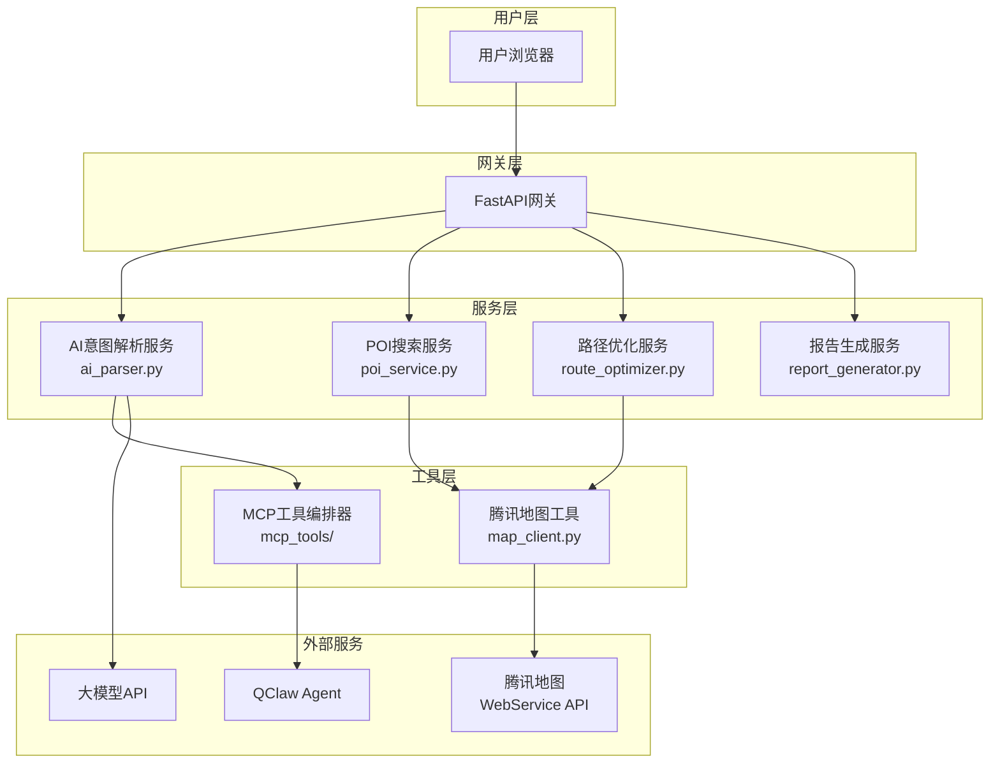

# 智能行程规划助手 — 后端系统分析设计文档

> 本文档为智能行程规划助手（Smart Trip Planner）的后端系统分析设计文档，详细阐述系统架构、模块设计、API接口、算法实现及QClaw集成方案。
> 活动关联：腾讯位置服务开发者征文大赛（CSDN id=11152）
> 版本：v1.0 | 最后更新：2026-04-14

---

## 1. 系统概述

### 1.1 项目定位

智能行程规划助手是一个AI驱动的旅行规划工具，用户输入自然语言旅行需求，系统通过AI意图解析、腾讯地图API调用、路径优化算法，输出完整的可视化行程方案。

### 1.2 系统边界

```
┌──────────────────────────────────────────────────────────────┐
│                        用户（浏览器/App）                     │
└────────────────────────────┬─────────────────────────────────┘
                             │ HTTPS / JSON
                             ▼
┌──────────────────────────────────────────────────────────────┐
│                      FastAPI 后端服务                         │
│  ┌──────────┐  ┌──────────┐  ┌──────────┐  ┌──────────┐   │
│  │ 意图解析 │  │ POI搜索  │  │ 路径优化 │  │ 报告生成 │   │
│  │  Service │  │  Service │  │  Service │  │  Service │   │
│  └────┬─────┘  └────┬─────┘  └────┬─────┘  └────┬─────┘   │
│       │              │              │              │          │
│  ┌────▼──────────────▼──────────────▼──────────────▼────┐   │
│  │              MCP 工具编排层                            │   │
│  └────┬──────────────┬──────────────┬──────────────┬────┘   │
│       │              │              │              │          │
│  ┌────▼────┐  ┌────▼────┐  ┌─────▼────┐  ┌────▼────┐  │
│  │ QClaw   │  │ 腾讯地图 │  │ 大模型   │  │  缓存   │  │
│  │ Agent   │  │ WebService│  │ API      │  │  Redis  │  │
│  └─────────┘  └─────────┘  └──────────┘  └─────────┘  │
└──────────────────────────────────────────────────────────────┘
```

### 1.3 外部依赖

| 依赖服务 | 用途 | 申请方式 |
|---------|------|---------|
| 腾讯位置服务 WebService API | POI搜索、地理编码、距离计算、路线规划 | 腾讯位置服务官网申请（免费额度：每日10000次）|
| 腾讯地图JS API | 前端地图可视化 | 同上 |
| QClaw / 大模型 API | AI意图解析、报告生成 | QClaw / OpenAI API Key |
| 缓存（Redis/内存）| POI数据缓存、距离矩阵缓存 | 可选，MVP用内存缓存 |

### 1.4 技术选型理由

| 组件 | 选型 | 理由 |
|------|------|------|
| 后端框架 | FastAPI | 异步支持好、自动API文档（Pydantic集成）、部署简单 |
| 数据验证 | Pydantic | 类型安全、自动序列化/反序列化、验证规则声明式 |
| HTTP客户端 | httpx | 异步支持好、FastAPI官方推荐 |
| 缓存 | 内存缓存（MVP）| 无额外依赖，后续可迁移到Redis |
| 地图API | 腾讯地图WebService | 活动要求、文档完善、中文支持好 |
| AI层 | QClaw + 大模型 | 活动明确提及（加分项）|

---

## 2. 架构设计

### 2.1 整体架构图



### 2.2 各层职责

| 层次 | 名称 | 职责 |
|------|------|------|
| L1 | 用户层 | HTTP请求接收、响应返回 |
| L2 | 网关层 | 路由分发、请求校验、认证、限流 |
| L3 | 服务层 | 业务逻辑编排、核心算法实现 |
| L4 | 工具层 | 外部API调用、QClaw Agent交互 |
| L5 | 外部服务 | 地图数据、AI能力 |

### 2.3 项目目录结构

```
backend/
├── app/
│   ├── __init__.py
│   ├── main.py                 # FastAPI 应用入口
│   ├── config.py              # 全局配置
│   ├── api/                   # API 路由
│   │   ├── __init__.py
│   │   ├── v1/
│   │   │   ├── __init__.py
│   │   │   ├── trip.py       # 行程规划接口
│   │   │   ├── poi.py        # POI 查询接口
│   │   │   └── health.py     # 健康检查
│   │   └── deps.py           # 依赖注入
│   ├── core/                  # 核心模块
│   │   ├── __init__.py
│   │   ├── config.py         # 配置管理
│   │   ├── cache.py          # 缓存管理
│   │   └── exceptions.py     # 自定义异常
│   ├── models/               # 数据模型
│   │   ├── __init__.py
│   │   ├── trip.py           # 行程相关模型
│   │   ├── poi.py            # POI相关模型
│   │   └── response.py        # 响应模型
│   ├── services/              # 业务逻辑服务
│   │   ├── __init__.py
│   │   ├── ai_parser.py      # AI意图解析
│   │   ├── poi_service.py    # POI服务
│   │   ├── route_optimizer.py# 路径优化
│   │   └── report_generator.py# 报告生成
│   ├── mcp_tools/            # MCP工具定义
│   │   ├── __init__.py
│   │   ├── base.py           # 工具基类
│   │   ├── tencent_map.py    # 腾讯地图工具集
│   │   └── registry.py       # 工具注册表
│   ├── clients/              # 外部API客户端
│   │   ├── __init__.py
│   │   ├── tencent_map_client.py  # 腾讯地图API客户端
│   │   └── llm_client.py     # 大模型API客户端
│   └── utils/                # 工具函数
│       ├── __init__.py
│       └── helpers.py         # 辅助函数
├── tests/                    # 测试
│   ├── __init__.py
│   ├── conftest.py
│   ├── test_ai_parser.py
│   ├── test_route_optimizer.py
│   └── test_poi_service.py
├── scripts/
│   └── register_mcp_tools.py # MCP工具注册脚本
├── requirements.txt
├── Dockerfile
└── docker-compose.yml
```

---

## 3. 模块详细设计

### 3.1 配置管理（app/core/config.py）

```python
"""
配置管理模块
统一管理所有配置项，支持环境变量覆盖
"""

from pydantic_settings import BaseSettings
from functools import lru_cache
from typing import Optional


class Settings(BaseSettings):
    """全局配置类"""

    # ========== 应用配置 ==========
    APP_NAME: str = "Smart Trip Planner"
    APP_VERSION: str = "1.0.0"
    DEBUG: bool = False
    HOST: str = "0.0.0.0"
    PORT: int = 8000

    # ========== 腾讯地图API配置 ==========
    TENCENT_MAP_API_KEY: str = ""          # 腾讯地图 API Key（必填）
    TENCENT_MAP_BASE_URL: str = "https://apis.map.qq.com"
    TENCENT_MAP_REGION: str = "全国"        # 默认搜索区域

    # ========== 大模型API配置 ==========
    LLM_PROVIDER: str = "qclaw"            # qclaw | openai | zhipu
    OPENAI_API_KEY: Optional[str] = None
    OPENAI_BASE_URL: str = "https://api.openai.com/v1"
    OPENAI_MODEL: str = "gpt-4o-mini"
    ZHIPU_API_KEY: Optional[str] = None
    ZHIPU_BASE_URL: str = "https://open.bigmodel.cn/api/paas/v4"

    # ========== QClaw配置 ==========
    QCLAW_ENABLED: bool = True             # 是否启用 QClaw
    QCLAW_API_KEY: Optional[str] = None
    QCLAW_BASE_URL: str = "https://api.qclaw.com/v1"

    # ========== 缓存配置 ==========
    CACHE_ENABLED: bool = True
    CACHE_TTL_SECONDS: int = 86400         # POI数据缓存24小时
    CACHE_MAX_SIZE: int = 1000             # 最大缓存条数

    # ========== 限流配置 ==========
    RATE_LIMIT_ENABLED: bool = True
    RATE_LIMIT_REQUESTS: int = 100         # 每分钟请求数
    RATE_LIMIT_WINDOW: int = 60             # 时间窗口（秒）

    # ========== 算法配置 ==========
    MAX_POIS_PER_SEARCH: int = 10           # POI搜索最大返回数
    MAX_TRIP_DAYS: int = 7                 # 最大行程天数
    MAX_ATTRACTION_PER_DAY: int = 6         # 每天最大景点数
    ROUTE_OPTIMIZATION_TIMEOUT: int = 5      # 路径优化超时（秒）

    class Config:
        env_file = ".env"
        env_file_encoding = "utf-8"
        case_sensitive = True
        extra = "ignore"


@lru_cache(maxsize=1)
def get_settings() -> Settings:
    """获取配置单例"""
    return Settings()
```

### 3.2 自定义异常（app/core/exceptions.py）

```python
"""
自定义异常定义
所有业务异常均在此定义，便于统一处理
"""

from fastapi import HTTPException, status


class TripPlannerException(Exception):
    """业务异常基类"""
    def __init__(self, message: str, code: str = "UNKNOWN_ERROR"):
        self.message = message
        self.code = code
        super().__init__(self.message)

    def to_http_exception(self) -> HTTPException:
        return HTTPException(
            status_code=status.HTTP_400_BAD_REQUEST,
            detail={"code": self.code, "message": self.message}
        )


class AIParseError(TripPlannerException):
    """AI意图解析异常"""
    def __init__(self, message: str = "AI意图解析失败"):
        super().__init__(message, code="AI_PARSE_ERROR")


class POISearchError(TripPlannerException):
    """POI搜索异常"""
    def __init__(self, message: str = "POI搜索失败"):
        super().__init__(message, code="POI_SEARCH_ERROR")


class POINotFoundError(TripPlannerException):
    """POI未找到"""
    def __init__(self, poi_name: str):
        super().__init__(f"未找到POI: {poi_name}", code="POI_NOT_FOUND")


class RouteOptimizationError(TripPlannerException):
    """路径优化异常"""
    def __init__(self, message: str = "路径优化失败"):
        super().__init__(message, code="ROUTE_ERROR")


class APIRateLimitError(TripPlannerException):
    """API限流异常"""
    def __init__(self, api_name: str):
        super().__init__(f"{api_name} API调用超出限制", code="RATE_LIMIT")


class InvalidInputError(TripPlannerException):
    """输入参数异常"""
    def __init__(self, message: str):
        super().__init__(message, code="INVALID_INPUT")
```

### 3.3 缓存管理（app/core/cache.py）

```python
"""
缓存管理模块
使用内存缓存（MVP），支持 TTL 自动过期
后续可迁移到 Redis
"""

import time
from typing import Any, Optional, Dict, Callable
from collections import OrderedDict
from threading import RLock


class LRUCache:
    """
    LRU（最近最少使用）缓存实现
    - 自动过期（TTL）
    - 线程安全
    - LRU淘汰策略
    """

    def __init__(self, max_size: int = 1000, default_ttl: int = 86400):
        self._cache: OrderedDict = OrderedDict()
        self._expiry: Dict[str, float] = {}
        self._max_size = max_size
        self._default_ttl = default_ttl
        self._lock = RLock()

    def get(self, key: str) -> Optional[Any]:
        """获取缓存值"""
        with self._lock:
            if key not in self._cache:
                return None

            # 检查过期
            if self._is_expired(key):
                self._remove(key)
                return None

            # 移到末尾（最近使用）
            self._cache.move_to_end(key)
            return self._cache[key]

    def set(self, key: str, value: Any, ttl: Optional[int] = None) -> None:
        """设置缓存值"""
        with self._lock:
            # 如果已存在，先移除
            if key in self._cache:
                self._remove(key)

            # 超过容量，淘汰最老的
            while len(self._cache) >= self._max_size:
                oldest = next(iter(self._cache))
                self._remove(oldest)

            # 写入
            self._cache[key] = value
            self._expiry[key] = time.time() + (ttl or self._default_ttl)

    def delete(self, key: str) -> None:
        """删除缓存"""
        with self._lock:
            self._remove(key)

    def clear(self) -> None:
        """清空缓存"""
        with self._lock:
            self._cache.clear()
            self._expiry.clear()

    def get_or_compute(self, key: str, fn: Callable[[], Any],
                       ttl: Optional[int] = None) -> Any:
        """获取缓存，如果没有则调用 fn 计算并缓存"""
        value = self.get(key)
        if value is None:
            value = fn()
            self.set(key, value, ttl)
        return value

    def _is_expired(self, key: str) -> bool:
        return time.time() > self._expiry.get(key, 0)

    def _remove(self, key: str) -> None:
        self._cache.pop(key, None)
        self._expiry.pop(key, None)


# 全局缓存实例
_poi_cache = LRUCache(max_size=2000, default_ttl=86400)      # POI数据缓存24小时
_distance_cache = LRUCache(max_size=5000, default_ttl=3600)     # 距离数据缓存1小时
_geocode_cache = LRUCache(max_size=1000, default_ttl=86400 * 7) # 地理编码缓存7天


def get_poi_cache() -> LRUCache:
    return _poi_cache


def get_distance_cache() -> LRUCache:
    return _distance_cache


def get_geocode_cache() -> LRUCache:
    return _geocode_cache
```

### 3.4 POI 数据模型（app/models/poi.py）

```python
"""
POI 相关数据模型
"""

from pydantic import BaseModel, Field, field_validator
from typing import Optional, List
from enum import Enum


class TransportMode(str, Enum):
    """交通方式枚举"""
    DRIVING = "driving"      # 驾车
    WALKING = "walking"      # 步行
    TRANSIT = "transit"     # 公交


class POI(BaseModel):
    """POI（兴趣点）模型"""
    id: str = Field(..., description="POI唯一标识")
    name: str = Field(..., description="POI名称")
    address: str = Field(..., description="详细地址")
    lat: float = Field(..., ge=-90, le=90, description="纬度")
    lng: float = Field(..., ge=-180, le=180, description="经度")
    category: str = Field(..., description="POI类别（景点/酒店/餐厅）")
    city: Optional[str] = Field(None, description="所在城市")
    district: Optional[str] = Field(None, description="所在行政区")
    tel: Optional[str] = Field(None, description="联系电话")
    rating: Optional[float] = Field(None, ge=0, le=5, description="评分")
    price_level: Optional[int] = Field(None, ge=1, le=4, description="消费水平 1-4")
    opening_hours: Optional[str] = Field(None, description="营业时间")
    photo_url: Optional[str] = Field(None, description="图片URL")
    distance_from_center: Optional[float] = Field(None, description="距市中心距离（米）")

    @field_validator("lat", "lng", mode="before")
    @classmethod
    def validate_coords(cls, v):
        if isinstance(v, str):
            return float(v)
        return v

    def to_coords(self) -> dict:
        """返回坐标字典"""
        return {"lat": self.lat, "lng": self.lng}


class POISearchResult(BaseModel):
    """POI搜索结果"""
    keyword: str = Field(..., description="搜索关键词")
    city: str = Field(..., description="搜索城市")
    total: int = Field(..., ge=0, description="总结果数")
    pois: List[POI] = Field(default_factory=list, description="POI列表")
    page_index: int = Field(default=1, ge=1, description="当前页码")
    page_size: int = Field(default=10, ge=1, le=50, description="每页大小")


class DistanceInfo(BaseModel):
    """两点间距离信息"""
    from_poi: POI = Field(..., description="起点POI")
    to_poi: POI = Field(..., description="终点POI")
    mode: TransportMode = Field(..., description="交通方式")
    distance_meters: int = Field(..., ge=0, description="距离（米）")
    duration_seconds: int = Field(..., ge=0, description="预估耗时（秒）")
    polyline: Optional[str] = Field(None, description="路线坐标串（编码）")


class DistanceMatrix(BaseModel):
    """距离矩阵"""
    pois: List[POI] = Field(..., description="POI列表")
    mode: TransportMode = Field(..., description="交通方式")
    # 矩阵[row][col] = DistanceInfo
    matrix: List[List[Optional[DistanceInfo]]] = Field(
        ..., description="距离矩阵"
    )

    def get_distance(self, from_idx: int, to_idx: int) -> Optional[DistanceInfo]:
        """获取两点间距离"""
        if 0 <= from_idx < len(self.matrix):
            if 0 <= to_idx < len(self.matrix[from_idx]):
                return self.matrix[from_idx][to_idx]
        return None
```

### 3.5 行程数据模型（app/models/trip.py）

```python
"""
行程相关数据模型
"""

from pydantic import BaseModel, Field, field_validator
from typing import Optional, List, Literal
from datetime import date
from enum import Enum


class TransportMode(str, Enum):
    DRIVING = "driving"
    WALKING = "walking"
    TRANSIT = "transit"
    MIXED = "mixed"  # 混合模式


class TripIntent(BaseModel):
    """用户旅行意图（AI解析结果）"""
    city: str = Field(..., min_length=1, description="目标城市")
    days: int = Field(..., ge=1, le=14, description="行程天数")
    attractions: List[str] = Field(..., min_length=1, description="景点名称列表")
    hotel_area: Optional[str] = Field(None, description="住宿区域偏好")
    budget_per_night: Optional[int] = Field(None, ge=0, description="每晚预算（元）")
    transport_mode: TransportMode = Field(default=TransportMode.MIXED, description="交通方式")
    food_budget_per_day: Optional[int] = Field(None, ge=0, description="每日餐饮预算")
    extra_notes: Optional[str] = Field(None, description="其他需求备注")

    def model_dump_safe(self) -> dict:
        """安全的序列化方法"""
        return {
            "city": self.city,
            "days": self.days,
            "attractions": self.attractions,
            "hotel_area": self.hotel_area,
            "budget_per_night": self.budget_per_night,
            "transport_mode": self.transport_mode.value,
            "food_budget_per_day": self.food_budget_per_day,
            "extra_notes": self.extra_notes,
        }


class AttractionInDay(BaseModel):
    """每天的景点"""
    name: str = Field(..., description="景点名称")
    poi: Optional[dict] = Field(None, description="POI详情（包含坐标）")
    arrival_time: str = Field(..., description="预计到达时间 HH:MM")
    departure_time: str = Field(..., description="预计离开时间 HH:MM")
    duration_minutes: int = Field(..., ge=0, description="游览时长（分钟）")
    transport_to_next: Optional[dict] = Field(None, description="到下一个景点的交通")


class DayPlan(BaseModel):
    """每日行程"""
    day: int = Field(..., ge=1, description="第几天")
    date: Optional[str] = Field(None, description="日期 YYYY-MM-DD")
    attractions: List[AttractionInDay] = Field(..., min_length=1, description="当天景点列表")
    total_distance_meters: int = Field(default=0, ge=0, description="当天总路程（米）")
    total_duration_minutes: int = Field(default=0, ge=0, description="当天总耗时（分钟）")


class HotelRecommendation(BaseModel):
    """住宿推荐"""
    name: str = Field(..., description="酒店名称")
    address: str = Field(..., description="地址")
    lat: float = Field(..., description="纬度")
    lng: float = Field(..., description="经度")
    price_per_night: Optional[int] = Field(None, description="每晚价格（元）")
    rating: Optional[float] = Field(None, description="评分")
    distance_from_center: Optional[float] = Field(None, description="距市中心距离（米）")
    district: Optional[str] = Field(None, description="行政区")
    reason: Optional[str] = Field(None, description="推荐理由")


class TripPlan(BaseModel):
    """完整行程方案"""
    intent: dict = Field(..., description="用户原始意图")
    city: str = Field(..., description="城市")
    days: int = Field(..., description="天数")
    day_plans: List[DayPlan] = Field(..., description="每日行程")
    hotels: List[HotelRecommendation] = Field(
        default_factory=list, description="推荐酒店列表"
    )
    total_distance_meters: int = Field(default=0, description="全程总路程（米）")
    estimated_cost: Optional[int] = Field(None, description="预估总花费（元）")
    tips: List[str] = Field(default_factory=list, description="出行建议")


class TripGenerationRequest(BaseModel):
    """行程生成请求"""
    user_input: str = Field(
        ...,
        min_length=5,
        description="用户自然语言输入"
    )
    start_date: Optional[str] = Field(None, description="出发日期 YYYY-MM-DD")
    confirm_intent: Optional[TripIntent] = Field(
        None, description="确认后的意图（可选，用于二次确认场景）"
    )


class TripGenerationResponse(BaseModel):
    """行程生成响应"""
    success: bool = Field(..., description="是否成功")
    trip_plan: Optional[TripPlan] = Field(None, description="行程方案")
    intent: Optional[TripIntent] = Field(None, description="解析后的意图")
    error: Optional[str] = Field(None, description="错误信息")
    processing_time_ms: int = Field(..., description="处理耗时（毫秒）")
```

---

## 4. 核心算法：路径优化

### 4.1 算法概述

路径优化的目标是在给定一组景点的情况下，找到最优的游览顺序，使得总行程时间或总距离最小。

**问题建模：**
- 输入：n个景点，每个景点有坐标(lat, lng)
- 输出：游览顺序，使得从出发点出发遍历所有景点后返回（或到达最后一个景点）的总距离最小

**MVP采用贪心最近邻算法**，时间复杂度O(n²)，适合n≤15的场景。


### 4.2 贪心最近邻算法（app/services/route_optimizer.py）

```python
"""
路径优化服务
使用贪心最近邻算法 + 2-opt 局部优化
"""

from typing import List, Tuple, Optional, Dict
from dataclasses import dataclass
from app.models.poi import POI, DistanceInfo, DistanceMatrix, TransportMode
from app.services.poi_service import TencentMapService
from app.core.exceptions import RouteOptimizationError
import itertools


@dataclass
class RouteSegment:
    """路线段"""
    from_poi: POI
    to_poi: POI
    distance_meters: int
    duration_seconds: int
    polyline: Optional[str] = None


class RouteOptimizer:
    """
    路径优化器

    使用贪心最近邻算法作为基础解，
    可选使用2-opt局部优化进一步改善结果。

    时间复杂度：O(n²)（贪心）+ O(n²×iterations)（2-opt）
    """

    def __init__(
        self,
        map_service: TencentMapService,
        max_opt_iterations: int = 100,
    ):
        self.map_service = map_service
        self.max_opt_iterations = max_opt_iterations

    async def optimize(
        self,
        pois: List[POI],
        start_poi: Optional[POI] = None,
        end_poi: Optional[POI] = None,
        mode: TransportMode = TransportMode.DRIVING,
    ) -> Tuple[List[POI], List[RouteSegment]]:
        """
        优化游览顺序

        Args:
            pois: 待游览的景点列表
            start_poi: 起点（可选，默认第一个景点）
            end_poi: 终点（可选）
            mode: 交通方式

        Returns:
            (优化后的顺序, 各段距离信息)

        Raises:
            RouteOptimizationError: 优化失败
        """
        if not pois:
            return [], []

        if len(pois) == 1:
            return pois, []

        try:
            # Step 1: 构建距离矩阵
            distance_matrix = await self._build_distance_matrix(pois, mode)

            # Step 2: 贪心最近邻得到初始解
            greedy_route = self._greedy_nearest_neighbor(pois, distance_matrix, start_poi)

            # Step 3: 2-opt 局部优化（可选）
            if len(greedy_route) >= 3:
                optimized_route = self._two_opt_improve(
                    greedy_route, distance_matrix
                )
            else:
                optimized_route = greedy_route

            # Step 4: 获取各段详细信息
            segments = await self._build_segments(
                optimized_route, end_poi, mode
            )

            return optimized_route, segments

        except Exception as e:
            raise RouteOptimizationError(f"路径优化失败: {str(e)}")

    async def _build_distance_matrix(
        self, pois: List[POI], mode: TransportMode
    ) -> List[List[float]]:
        """构建距离矩阵"""
        n = len(pois)
        matrix = [[0.0] * n for _ in range(n)]

        # 腾讯地图距离API支持批量计算（一次最多20个起点/终点）
        # 这里简化处理，逐对计算
        for i in range(n):
            for j in range(n):
                if i != j:
                    info = await self.map_service.get_distance(
                        from_poi=pois[i],
                        to_poi=pois[j],
                        mode=mode,
                    )
                    matrix[i][j] = info.distance_meters if info else float('inf')
                else:
                    matrix[i][j] = 0.0

        return matrix

    def _greedy_nearest_neighbor(
        self,
        pois: List[POI],
        distance_matrix: List[List[float]],
        start_poi: Optional[POI] = None,
    ) -> List[POI]:
        """
        贪心最近邻算法

        思路：从起点出发，每次选择最近的未访问景点
        """
        n = len(pois)
        unvisited = set(range(n))
        route = []

        # 确定起点
        if start_poi:
            start_idx = pois.index(start_poi)
        else:
            start_idx = 0

        route.append(start_idx)
        unvisited.remove(start_idx)
        current = start_idx

        while unvisited:
            # 找最近的未访问景点
            nearest = min(unvisited, key=lambda x: distance_matrix[current][x])
            route.append(nearest)
            unvisited.remove(nearest)
            current = nearest

        return [pois[i] for i in route]

    def _two_opt_improve(
        self,
        route: List[POI],
        distance_matrix: List[List[float]],
    ) -> List[POI]:
        """
        2-opt 局部优化算法

        思路：遍历所有可能的"交换一条边"的操作，
        如果交换后总距离减少，则接受交换

        交换规则：选择i<j，交换route[i+1...j-1]的顺序
        """
        improved = True
        iterations = 0
        best_route = route[:]
        best_cost = self._calc_total_distance(best_route, distance_matrix)

        while improved and iterations < self.max_opt_iterations:
            improved = False
            iterations += 1

            for i in range(1, len(best_route) - 2):
                for j in range(i + 1, len(best_route) - 1):
                    # 尝试交换 route[i] 和 route[j]
                    new_route = (
                        best_route[:i]
                        + best_route[i:j+1][::-1]
                        + best_route[j+1:]
                    )
                    new_cost = self._calc_total_distance(new_route, distance_matrix)

                    if new_cost < best_cost:
                        best_route = new_route
                        best_cost = new_cost
                        improved = True
                        break
                if improved:
                    break

        return best_route

    def _calc_total_distance(
        self, route: List[POI], distance_matrix: List[List[float]]
    ) -> float:
        """计算路线总距离"""
        total = 0.0
        for i in range(len(route) - 1):
            from_idx = None
            to_idx = None
            for j, poi in enumerate(route):
                if poi.id == route[i].id:
                    from_idx = j
                if poi.id == route[i+1].id:
                    to_idx = j
            if from_idx is not None and to_idx is not None:
                total += distance_matrix[from_idx][to_idx]
        return total

    async def _build_segments(
        self,
        route: List[POI],
        end_poi: Optional[POI],
        mode: TransportMode,
    ) -> List[RouteSegment]:
        """构建各段路线详细信息"""
        segments = []
        pois_to_fetch = route[:]

        if end_poi and end_poi not in pois_to_fetch:
            pois_to_fetch.append(end_poi)

        for i in range(len(pois_to_fetch) - 1):
            from_poi = pois_to_fetch[i]
            to_poi = pois_to_fetch[i + 1]

            distance_info = await self.map_service.get_distance(
                from_poi=from_poi, to_poi=to_poi, mode=mode
            )

            if distance_info:
                segment = RouteSegment(
                    from_poi=from_poi,
                    to_poi=to_poi,
                    distance_meters=distance_info.distance_meters,
                    duration_seconds=distance_info.duration_seconds,
                    polyline=distance_info.polyline,
                )
                segments.append(segment)
            else:
                segments.append(RouteSegment(
                    from_poi=from_poi,
                    to_poi=to_poi,
                    distance_meters=0,
                    duration_seconds=0,
                ))

        return segments


def estimate_total_distance(route: List[POI], mode: TransportMode) -> float:
    """
    估算总距离（使用直线距离，不调用API）
    作为初始估计，用于判断是否值得调用API
    """
    import math

    def haversine(p1: POI, p2: POI) -> float:
        """计算两点间直线距离（米）"""
        R = 6371000  # 地球半径（米）
        lat1, lng1 = math.radians(p1.lat), math.radians(p1.lng)
        lat2, lng2 = math.radians(p2.lat), math.radians(p2.lng)
        dlat = lat2 - lat1
        dlng = lng2 - lng1
        a = math.sin(dlat/2)**2 + math.cos(lat1) * math.cos(lat2) * math.sin(dlng/2)**2
        c = 2 * math.asin(math.sqrt(a))
        return R * c

    total = 0.0
    for i in range(len(route) - 1):
        total += haversine(route[i], route[i+1])

    # 直线距离乘以1.4系数估算实际路程（平均绕路系数）
    return total * 1.4
```

---

## 5. API 接口设计

### 5.1 API 路由（app/api/v1/trip.py）

```python
"""
行程规划 API 路由
"""

from fastapi import APIRouter, Depends, BackgroundTasks
from fastapi.responses import JSONResponse
from app.models.trip import (
    TripGenerationRequest,
    TripGenerationResponse,
    TripPlan,
    TripIntent,
)
from app.services.ai_parser import AIParserService
from app.services.poi_service import TencentMapService
from app.services.route_optimizer import RouteOptimizer
from app.services.report_generator import ReportGenerator
from app.core.exceptions import (
    TripPlannerException,
    AIParseError,
    POISearchError,
    RouteOptimizationError,
)
import time

router = APIRouter(prefix="/api/v1", tags=["行程规划"])


@router.post("/trip/generate", response_model=TripGenerationResponse)
async def generate_trip(
    request: TripGenerationRequest,
) -> TripGenerationResponse:
    """
    生成行程方案

    工作流程：
    1. AI 解析用户输入 → TripIntent
    2. POI 搜索 → 各景点详细信息
    3. 路径优化 → 最优游览顺序
    4. 住宿推荐 → 基于景点分布推荐酒店
    5. 生成报告 → 结构化行程方案
    """
    start_time = time.time()

    try:
        # ========== Step 1: AI 意图解析 ==========
        ai_parser = AIParserService()
        intent = await ai_parser.parse(request.user_input)

        # 如果用户确认了意图，使用确认的意图
        if request.confirm_intent:
            intent = request.confirm_intent

        # ========== Step 2: POI 搜索 ==========
        map_service = TencentMapService()
        all_pois = []

        for attraction in intent.attractions:
            pois = await map_service.search_poi(
                keyword=attraction,
                city=intent.city,
                category="景点",
            )
            if pois:
                # 取第一个结果（后续可做消歧）
                all_pois.append(pois[0])

        if not all_pois:
            raise POISearchError(f"未找到任何景点: {intent.attractions}")

        # ========== Step 3: 路径优化 ==========
        optimizer = RouteOptimizer(map_service)
        optimized_route, segments = await optimizer.optimize(
            pois=all_pois,
            mode=intent.transport_mode,
        )

        # ========== Step 4: 住宿推荐 ==========
        hotel_pois = await map_service.search_nearby(
            center=optimized_route[0],  # 基于第一个景点
            keyword="酒店",
            city=intent.city,
            radius=3000,  # 3公里内
        )

        # ========== Step 5: 生成行程 ==========
        report_gen = ReportGenerator()
        trip_plan = await report_gen.generate(
            intent=intent,
            route=optimized_route,
            segments=segments,
            hotels=hotel_pois[:3],
        )

        processing_time_ms = int((time.time() - start_time) * 1000)

        return TripGenerationResponse(
            success=True,
            trip_plan=trip_plan,
            intent=intent,
            processing_time_ms=processing_time_ms,
        )

    except TripPlannerException as e:
        processing_time_ms = int((time.time() - start_time) * 1000)
        return TripGenerationResponse(
            success=False,
            error=str(e),
            processing_time_ms=processing_time_ms,
        )
    except Exception as e:
        processing_time_ms = int((time.time() - start_time) * 1000)
        return TripGenerationResponse(
            success=False,
            error=f"系统错误: {str(e)}",
            processing_time_ms=processing_time_ms,
        )


@router.post("/trip/confirm", response_model=TripGenerationResponse)
async def confirm_and_generate(
    intent: TripIntent,
) -> TripGenerationResponse:
    """
    确认意图后生成行程（用户手动调整后）
    """
    request = TripGenerationRequest(
        user_input="",
        confirm_intent=intent,
    )
    return await generate_trip(request)


@router.get("/api/v1/poi/search")
async def search_poi(
    keyword: str,
    city: str,
    category: str = "景点",
    page_size: int = 10,
) -> dict:
    """POI 搜索接口（调试用）"""
    map_service = TencentMapService()
    pois = await map_service.search_poi(
        keyword=keyword, city=city, category=category, page_size=page_size
    )
    return {
        "keyword": keyword,
        "city": city,
        "total": len(pois),
        "pois": [poi.model_dump() for poi in pois],
    }


@router.get("/api/v1/health")
async def health_check() -> dict:
    """健康检查"""
    return {"status": "ok", "service": "Smart Trip Planner"}
```

### 5.2 错误码定义

| 错误码 | HTTP状态码 | 说明 | 处理建议 |
|--------|-----------|------|---------|
| `AI_PARSE_ERROR` | 400 | AI意图解析失败 | 检查输入格式，重试 |
| `POI_SEARCH_ERROR` | 400 | POI搜索失败 | 检查城市名称，重试 |
| `POI_NOT_FOUND` | 404 | 未找到指定POI | 更换关键词或城市 |
| `ROUTE_ERROR` | 400 | 路径优化失败 | 减少景点数量重试 |
| `RATE_LIMIT` | 429 | API限流 | 等待后重试 |
| `INVALID_INPUT` | 400 | 参数校验失败 | 检查参数格式 |
| `SYSTEM_ERROR` | 500 | 系统内部错误 | 联系技术支持 |

---

## 6. MCP 工具实现

### 6.1 工具基类（app/mcp_tools/base.py）

```python
"""
MCP 工具基类
定义工具接口规范
"""

from abc import ABC, abstractmethod
from typing import Any, Dict, Optional
from pydantic import BaseModel


class ToolParameter(BaseModel):
    """工具参数定义"""
    name: str
    type: str  # string, number, boolean
    description: str
    required: bool = True
    default: Optional[Any] = None


class ToolResult(BaseModel):
    """工具执行结果"""
    success: bool
    data: Optional[Any] = None
    error: Optional[str] = None


class BaseTool(ABC):
    """工具基类"""

    name: str = ""           # 工具名称（唯一标识）
    description: str = ""     # 工具描述（Agent 用于决定何时调用）
    parameters: list[ToolParameter] = []  # 参数定义

    @abstractmethod
    async def execute(self, **kwargs) -> ToolResult:
        """
        执行工具

        Returns:
            ToolResult: 执行结果
        """
        pass

    def to_mcp_schema(self) -> Dict[str, Any]:
        """转换为 MCP 协议格式"""
        return {
            "name": self.name,
            "description": self.description,
            "inputSchema": {
                "type": "object",
                "properties": {
                    p.name: {
                        "type": p.type,
                        "description": p.description,
                    }
                    for p in self.parameters
                },
                "required": [
                    p.name for p in self.parameters if p.required
                ],
            },
        }

    async def __call__(self, **kwargs) -> ToolResult:
        """便捷调用方式"""
        return await self.execute(**kwargs)
```

### 6.2 腾讯地图工具集（app/mcp_tools/tencent_map.py）

```python
"""
腾讯地图 MCP 工具集
封装所有腾讯地图 API 调用为 MCP 工具
"""

from app.mcp_tools.base import BaseTool, ToolResult, ToolParameter
from app.services.poi_service import TencentMapService
from app.models.poi import POI, TransportMode
from typing import Optional, Literal


class POISearchTool(BaseTool):
    """POI 搜索工具"""

    name = "tencentmap_poi_search"
    description = "搜索景点、酒店、餐厅等POI地点。需要提供关键词和城市名。返回匹配结果列表，包含坐标、地址、评分等信息。"
    parameters = [
        ToolParameter(
            name="keyword",
            type="string",
            description="搜索关键词，如'故宫'、'天安门'、'王府井酒店'",
            required=True,
        ),
        ToolParameter(
            name="city",
            type="string",
            description="城市名称，如'北京'、'上海'",
            required=True,
        ),
        ToolParameter(
            name="category",
            type="string",
            description="POI类别：景点/酒店/餐厅/购物/娱乐（默认：景点）",
            required=False,
            default="景点",
        ),
        ToolParameter(
            name="page_size",
            type="number",
            description="返回结果数量（默认10，最多50）",
            required=False,
            default=10,
        ),
    ]

    def __init__(self, map_service: TencentMapService):
        self.map_service = map_service

    async def execute(
        self,
        keyword: str,
        city: str,
        category: str = "景点",
        page_size: int = 10,
    ) -> ToolResult:
        try:
            pois = await self.map_service.search_poi(
                keyword=keyword,
                city=city,
                category=category,
                page_size=page_size,
            )
            return ToolResult(
                success=True,
                data={
                    "keyword": keyword,
                    "total": len(pois),
                    "results": [
                        {
                            "id": poi.id,
                            "name": poi.name,
                            "address": poi.address,
                            "lat": poi.lat,
                            "lng": poi.lng,
                            "category": poi.category,
                            "rating": poi.rating,
                        }
                        for poi in pois
                    ],
                },
            )
        except Exception as e:
            return ToolResult(success=False, error=str(e))


class GeocodeTool(BaseTool):
    """地理编码工具：地址 → 坐标"""

    name = "tencentmap_geocode"
    description = "将文字地址转换为经纬度坐标。如果只知道地址名称（如'北京故宫'），使用此工具获取精确坐标。"
    parameters = [
        ToolParameter(
            name="address",
            type="string",
            description="详细地址，如'北京市东城区景山前街4号'",
            required=True,
        ),
    ]

    def __init__(self, map_service: TencentMapService):
        self.map_service = map_service

    async def execute(self, address: str) -> ToolResult:
        try:
            info = await self.map_service.geocode(address)
            return ToolResult(
                success=True,
                data={
                    "address": info.get("address"),
                    "lat": info.get("lat"),
                    "lng": info.get("lng"),
                    "province": info.get("province"),
                    "city": info.get("city"),
                    "district": info.get("district"),
                },
            )
        except Exception as e:
            return ToolResult(success=False, error=str(e))


class DistanceTool(BaseTool):
    """距离计算工具：两点间距离和耗时"""

    name = "tencentmap_distance"
    description = "计算两个地点之间的距离和预估通行时间。需要提供起点和终点的坐标，以及交通方式。"
    parameters = [
        ToolParameter(
            name="from_lat",
            type="number",
            description="起点纬度",
            required=True,
        ),
        ToolParameter(
            name="from_lng",
            type="number",
            description="起点经度",
            required=True,
        ),
        ToolParameter(
            name="to_lat",
            type="number",
            description="终点纬度",
            required=True,
        ),
        ToolParameter(
            name="to_lng",
            type="number",
            description="终点经度",
            required=True,
        ),
        ToolParameter(
            name="mode",
            type="string",
            description="交通方式：driving(驾车)/walking(步行)/transit(公交)",
            required=False,
            default="driving",
        ),
    ]

    def __init__(self, map_service: TencentMapService):
        self.map_service = map_service

    async def execute(
        self,
        from_lat: float,
        from_lng: float,
        to_lat: float,
        to_lng: float,
        mode: str = "driving",
    ) -> ToolResult:
        try:
            mode_enum = TransportMode(mode)
            info = await self.map_service.get_distance_by_coords(
                from_lat=from_lat,
                from_lng=from_lng,
                to_lat=to_lat,
                to_lng=to_lng,
                mode=mode_enum,
            )
            return ToolResult(
                success=True,
                data={
                    "distance_meters": info.distance_meters,
                    "duration_seconds": info.duration_seconds,
                    "mode": mode,
                },
            )
        except Exception as e:
            return ToolResult(success=False, error=str(e))


class DirectionTool(BaseTool):
    """路线规划工具：获取详细路线"""

    name = "tencentmap_direction"
    description = "规划从起点到终点的路线，返回路线坐标点序列，可用于在地图上绘制路线。"
    parameters = [
        ToolParameter(
            name="from_lat",
            type="number",
            description="起点纬度",
            required=True,
        ),
        ToolParameter(
            name="from_lng",
            type="number",
            description="起点经度",
            required=True,
        ),
        ToolParameter(
            name="to_lat",
            type="number",
            description="终点纬度",
            required=True,
        ),
        ToolParameter(
            name="to_lng",
            type="number",
            description="终点经度",
            required=True,
        ),
        ToolParameter(
            name="mode",
            type="string",
            description="交通方式：driving/walking/transit",
            required=False,
            default="driving",
        ),
    ]

    def __init__(self, map_service: TencentMapService):
        self.map_service = map_service

    async def execute(
        self,
        from_lat: float,
        from_lng: float,
        to_lat: float,
        to_lng: float,
        mode: str = "driving",
    ) -> ToolResult:
        try:
            mode_enum = TransportMode(mode)
            info = await self.map_service.get_direction(
                from_lat=from_lat,
                from_lng=from_lng,
                to_lat=to_lat,
                to_lng=to_lng,
                mode=mode_enum,
            )
            return ToolResult(
                success=True,
                data={
                    "distance_meters": info.distance_meters,
                    "duration_seconds": info.duration_seconds,
                    "polyline": info.polyline,
                    "mode": mode,
                },
            )
        except Exception as e:
            return ToolResult(success=False, error=str(e))


class ReverseGeocodeTool(BaseTool):
    """逆地理编码工具：坐标 → 地址"""

    name = "tencentmap_reverse_geocode"
    description = "将经纬度坐标转换为文字地址描述。用于确认某个坐标的具体位置。"
    parameters = [
        ToolParameter(
            name="lat",
            type="number",
            description="纬度",
            required=True,
        ),
        ToolParameter(
            name="lng",
            type="number",
            description="经度",
            required=True,
        ),
    ]

    def __init__(self, map_service: TencentMapService):
        self.map_service = map_service

    async def execute(self, lat: float, lng: float) -> ToolResult:
        try:
            info = await self.map_service.reverse_geocode(lat=lat, lng=lng)
            return ToolResult(
                success=True,
                data={
                    "address": info.get("address"),
                    "province": info.get("province"),
                    "city": info.get("city"),
                    "district": info.get("district"),
                },
            )
        except Exception as e:
            return ToolResult(success=False, error=str(e))


class NearbySearchTool(BaseTool):
    """周边搜索工具"""

    name = "tencentmap_nearby_search"
    description = "搜索指定坐标周边一定范围内的POI，如周边酒店、餐厅、停车场等。"
    parameters = [
        ToolParameter(
            name="center_lat",
            type="number",
            description="中心点纬度",
            required=True,
        ),
        ToolParameter(
            name="center_lng",
            type="number",
            description="中心点经度",
            required=True,
        ),
        ToolParameter(
            name="keyword",
            type="string",
            description="搜索关键词",
            required=True,
        ),
        ToolParameter(
            name="radius",
            type="number",
            description="搜索半径（米），最大3000",
            required=False,
            default=1000,
        ),
        ToolParameter(
            name="city",
            type="string",
            description="城市名称",
            required=True,
        ),
    ]

    def __init__(self, map_service: TencentMapService):
        self.map_service = map_service

    async def execute(
        self,
        center_lat: float,
        center_lng: float,
        keyword: str,
        radius: int = 1000,
        city: str = "",
    ) -> ToolResult:
        try:
            pois = await self.map_service.search_nearby(
                center_lat=center_lat,
                center_lng=center_lng,
                keyword=keyword,
                radius=radius,
                city=city,
            )
            return ToolResult(
                success=True,
                data={
                    "keyword": keyword,
                    "radius": radius,
                    "total": len(pois),
                    "results": [
                        poi.model_dump() for poi in pois
                    ],
                },
            )
        except Exception as e:
            return ToolResult(success=False, error=str(e))
```

---

## 7. QClaw 集成方案

### 7.1 集成架构

```
QClaw Agent（AI Agent）
  │
  │  1. 用户输入旅行需求
  ▼
  ├─► 意图解析（LLM + System Prompt）
  │     └─► 输出结构化 TripIntent JSON
  │
  ├─► 工具调用（Tool Calling）
  │     ├─► tencentmap_poi_search → 搜索景点POI
  │     ├─► tencentmap_distance → 计算景点间距离
  │     ├─► tencentmap_direction → 获取路线
  │     └─► tencentmap_nearby_search → 搜索周边住宿
  │
  │  2. 汇总结果 → 生成行程方案
  ▼
  └─► 输出完整行程报告
```

### 7.2 QClaw Agent System Prompt

```python
SYSTEM_PROMPT = """你是智能行程规划助手。你的任务是根据用户的旅行需求，
规划完整的行程方案。

## 工作流程

1. **理解需求**：解析用户的自然语言输入，提取关键信息
   - 城市、天数
   - 景点列表
   - 住宿偏好（区域、预算）
   - 交通方式偏好

2. **搜索景点**：
   使用 `tencentmap_poi_search` 搜索每个景点的详细信息。
   注意：搜索时使用城市名限定，避免同名地点混淆。

3. **计算距离**：
   使用 `tencentmap_distance` 计算各景点之间的距离。
   选择合适的交通方式（driving/walking/transit）。

4. **规划路线**：
   基于距离信息，用贪心算法规划最优游览顺序。
   原则：先规划同区域景点，减少路上时间。

5. **推荐住宿**：
   使用 `tencentmap_nearby_search` 在景点密集区域搜索酒店。
   优先选择评分高、距离近、符合预算的酒店。

6. **生成报告**：
   输出结构化的行程方案，包含：
   - 每日行程安排（时间、景点、交通）
   - 推荐酒店
   - 出行小贴士

## 输出格式

```json
{
  "city": "城市名",
  "days": 3,
  "itinerary": [
    {
      "day": 1,
      "date": "可选日期",
      "attractions": [
        {
          "name": "景点名",
          "arrival": "09:00",
          "departure": "11:00",
          "tips": "游览建议"
        }
      ],
      "transport": "当天交通方式"
    }
  ],
  "hotels": [
    {
      "name": "酒店名",
      "district": "区",
      "price": 300,
      "reason": "推荐理由"
    }
  ],
  "tips": ["出行建议1", "建议2"]
}
```

## 约束

- 每个景点游览时间不少于1小时（知名景点2-3小时）
- 每天不超过4个主要景点
- 住宿优先选择景点密集区域或交通枢纽附近
- 交通时间超过1小时的两景点不建议放在同一天
- 如果景点间距离超过50km，建议调整游览顺序或分在不同日期
"""
```

### 7.3 QClaw API 调用示例

```python
"""
QClaw Agent 调用示例
"""

import httpx
from typing import Optional


class QClawClient:
    """QClaw Agent API 客户端"""

    def __init__(
        self,
        api_key: str,
        base_url: str = "https://api.qclaw.com/v1",
    ):
        self.api_key = api_key
        self.base_url = base_url
        self.tools = self._register_tools()

    def _register_tools(self) -> list:
        """注册 MCP 工具"""
        # 这里导入项目中定义的 MCP 工具
        from app.mcp_tools.tencent_map import (
            POISearchTool,
            GeocodeTool,
            DistanceTool,
            DirectionTool,
            ReverseGeocodeTool,
            NearbySearchTool,
        )
        from app.services.poi_service import TencentMapService

        map_service = TencentMapService()

        return [
            POISearchTool(map_service),
            GeocodeTool(map_service),
            DistanceTool(map_service),
            DirectionTool(map_service),
            ReverseGeocodeTool(map_service),
            NearbySearchTool(map_service),
        ]

    async def chat(
        self,
        user_message: str,
        system_prompt: Optional[str] = None,
    ) -> dict:
        """发送对话请求"""
        async with httpx.AsyncClient() as client:
            response = await client.post(
                f"{self.base_url}/chat/completions",
                headers={
                    "Authorization": f"Bearer {self.api_key}",
                    "Content-Type": "application/json",
                },
                json={
                    "model": "qclaw-agent",
                    "messages": [
                        *([{"role": "system", "content": system_prompt}]
                            if system_prompt else [],
                        {"role": "user", "content": user_message},
                    ],
                    "tools": [tool.to_mcp_schema() for tool in self.tools],
                    "tool_choice": "auto",
                },
                timeout=60.0,
            )
            response.raise_for_status()
            return response.json()

    async def parse_trip_intent(self, user_input: str) -> dict:
        """解析旅行意图"""
        system_prompt = """你是一个旅行规划助手。用户会输入旅行需求，
        请提取以下信息并以JSON格式返回：
        - city: 城市名
        - days: 天数
        - attractions: 景点列表（数组）
        - hotel_area: 住宿区域偏好
        - budget_per_night: 每晚预算（元）
        - transport_mode: 交通偏好（driving/walking/transit/mixed）

        只返回JSON，不要其他内容。"""

        result = await self.chat(user_input, system_prompt)
        return result
```

---

## 8. 错误处理与容错

### 8.1 异常分类

| 异常类 | 触发条件 | HTTP状态码 | 用户提示 |
|--------|---------|-----------|---------|
| AIParseError | LLM 调用失败或解析错误 | 400 | "无法理解您的输入，请换种说法" |
| POISearchError | 腾讯地图 API 返回错误 | 400 | "搜索景点失败，请稍后重试" |
| POINotFoundError | 搜索结果为空 | 404 | "未找到该景点，请检查名称" |
| RouteOptimizationError | 算法执行异常 | 400 | "路线规划失败，请减少景点数量" |
| APIRateLimitError | API 调用超限 | 429 | "服务繁忙，请稍后再试" |
| InvalidInputError | 参数校验失败 | 400 | 根据具体字段返回 |
| NetworkError | 网络请求异常 | 502 | "网络连接异常，请检查网络" |

### 8.2 重试策略

```python
"""
重试装饰器
"""

import asyncio
from functools import wraps
from app.core.exceptions import APIRateLimitError


def retry_on_rate_limit(
    max_retries: int = 3,
    base_delay: float = 1.0,
    max_delay: float = 30.0,
):
    """
    当遇到限流错误时自动重试（指数退避）

    Args:
        max_retries: 最大重试次数
        base_delay: 基础退避延迟（秒）
        max_delay: 最大延迟上限
    """
    def decorator(func):
        @wraps(func)
        async def wrapper(*args, **kwargs):
            delay = base_delay
            last_error = None

            for attempt in range(max_retries + 1):
                try:
                    return await func(*args, **kwargs)
                except APIRateLimitError as e:
                    last_error = e
                    if attempt < max_retries:
                        await asyncio.sleep(delay)
                        delay = min(delay * 2, max_delay)
                    else:
                        raise
                except Exception:
                    raise  # 非限流异常不重试

            raise last_error

        return wrapper
    return decorator


# 使用示例
@retry_on_rate_limit(max_retries=3, base_delay=1.0)
async def call_tencent_map_api(params: dict):
    """调用腾讯地图 API（带自动重试）"""
    ...
```

### 8.3 降级方案

| 场景 | 降级策略 |
|------|---------|
| 腾讯地图 API 完全不可用 | 使用缓存数据 + 直线距离估算 |
| POI 搜索无结果 | 提示用户更换关键词或扩大搜索范围 |
| 路径优化超时 | 返回贪心算法的初始解（不做2-opt优化）|
| LLM API 不可用 | 返回结构化表单，让用户手动确认景点 |

---

## 9. 性能优化

### 9.1 缓存策略

| 数据类型 | 缓存TTL | 淘汰策略 | 说明 |
|---------|--------|---------|------|
| POI 基础信息 | 24小时 | LRU | 景点信息相对稳定 |
| POI 搜索结果 | 1小时 | LRU | 热门景点搜索结果 |
| 地理编码结果 | 7天 | LRU | 地址→坐标基本不变 |
| 距离矩阵 | 1小时 | LRU | 考虑实时交通变化 |
| 路线规划 | 2小时 | LRU | 路线规划结果 |

### 9.2 并发控制

```python
"""
并发控制：信号量限制
"""

import asyncio
from app.config import get_settings

settings = get_settings()

# 全局信号量，限制同时进行的 API 调用数
_api_semaphore = asyncio.Semaphore(
    settings.RATE_LIMIT_REQUESTS  # 最多同时10个API请求
)


async def rate_limited_api_call(api_fn, *args, **kwargs):
    """
    带并发限制的 API 调用

    超过限制时自动排队，避免触发腾讯地图 API 限流
    """
    async with _api_semaphore:
        return await api_fn(*args, **kwargs)


# 使用示例
async def search_all_pois(keywords: List[str], city: str):
    """并发搜索多个景点（有并发控制）"""
    tasks = [
        rate_limited_api_call(
            map_service.search_poi,
            keyword=kw,
            city=city,
        )
        for kw in keywords
    ]
    results = await asyncio.gather(*tasks, return_exceptions=True)
    # 处理异常结果
    valid_results = [r for r in results if not isinstance(r, Exception)]
    return valid_results
```

### 9.3 性能指标

| 指标 | 目标值 | 告警阈值 |
|------|--------|---------|
| P50 响应时间 | ≤500ms | >1s |
| P95 响应时间 | ≤2s | >5s |
| P99 响应时间 | ≤5s | >10s |
| API 限流率 | ≤1% | >5% |
| POI 缓存命中率 | ≥60% | <40% |

---

## 10. FastAPI 入口（app/main.py）

```python
"""
FastAPI 应用入口
"""

from fastapi import FastAPI, Request
from fastapi.middleware.cors import CORSMiddleware
from fastapi.responses import JSONResponse
from app.api.v1 import trip, poi, health
from app.core.exceptions import TripPlannerException
import logging

logging.basicConfig(level=logging.INFO)
logger = logging.getLogger(__name__)

app = FastAPI(
    title="智能行程规划助手 API",
    description="AI驱动的旅行规划工具",
    version="1.0.0",
)

# ========== CORS ==========
app.add_middleware(
    CORSMiddleware,
    allow_origins=["*"],
    allow_credentials=True,
    allow_methods=["*"],
    allow_headers=["*"],
)

# ========== 全局异常处理 ==========
@app.exception_handler(TripPlannerException)
async def trip_planner_exception_handler(
    request: Request, exc: TripPlannerException
):
    return JSONResponse(
        status_code=400,
        content={"code": exc.code, "message": exc.message},
    )


@app.exception_handler(Exception)
async def general_exception_handler(request: Request, exc: Exception):
    logger.error(f"Unhandled exception: {exc}", exc_info=True)
    return JSONResponse(
        status_code=500,
        content={"code": "SYSTEM_ERROR", "message": "系统内部错误"},
    )


# ========== 注册路由 ==========
app.include_router(health.router)
app.include_router(trip.router)
app.include_router(poi.router)


@app.get("/")
async def root():
    return {
        "name": "Smart Trip Planner",
        "version": "1.0.0",
        "docs": "/docs",
    }


# ========== 启动命令 ==========
# uvicorn app.main:app --host 0.0.0.0 --port 8000 --reload
```

---

## 附录

### A. 环境变量配置（.env 示例）

```bash
# 腾讯地图API（必填）
TENCENT_MAP_API_KEY=YOUR_API_KEY_HERE

# 大模型API
OPENAI_API_KEY=sk-xxx
OPENAI_MODEL=gpt-4o-mini

# QClaw（可选）
QCLAW_ENABLED=true
QCLAW_API_KEY=your_qclaw_key

# 应用配置
DEBUG=true
HOST=0.0.0.0
PORT=8000
```

### B. 依赖包（requirements.txt）

```
fastapi>=0.109.0
uvicorn[standard]>=0.27.0
pydantic>=2.5.0
pydantic-settings>=2.1.0
httpx>=0.26.0
python-dotenv>=1.0.0
```

### C. Docker 部署（Dockerfile）

```dockerfile
FROM python:3.11-slim

WORKDIR /app

COPY requirements.txt .
RUN pip install --no-cache-dir -r requirements.txt

COPY . .

EXPOSE 8000

CMD ["uvicorn", "app.main:app", "--host", "0.0.0.0", "--port", "8000"]
```

---

*文档版本：v1.0*
*后端架构师：Claude Code*
*最后更新：2026-04-14*
